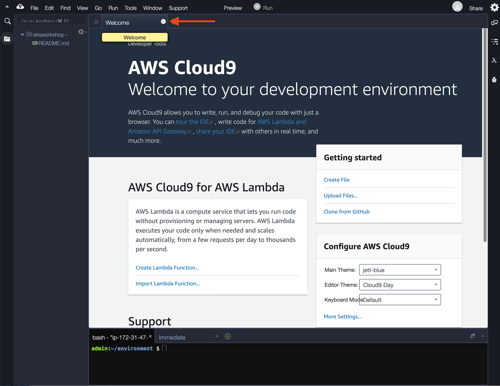
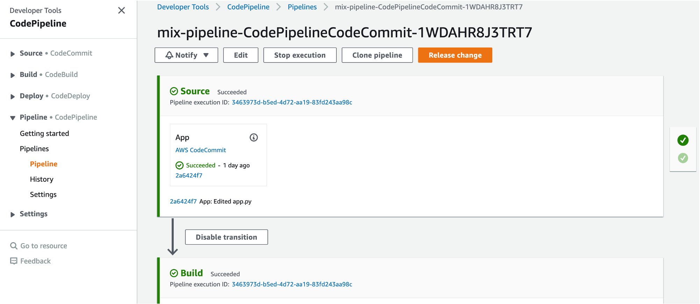

# 핸즈온랩 가이드
본 자료는 EKS를 위한 CI/CD 환경을 구축하는 실습 자료입니다. AWS에서는 CI/CD 파이프라인을 구축하기 위해서 CodeCommit, CodeBuild, CodeDeploy, CodePipeline등의 서비스를 제공합니다. 본 실습에서는 이런 서비스들을 활용하여 CI/CD 파이프라인 구축하고, 새로운 코드를 커밋할 때마다 컨테이너 이미지를 빌드하고 ECR에 저장한 뒤에 EKS 클러스터에 자동으로 배포하는 과정을 실습합니다. 또한, 요즘 유행하고 있는 GitOps로 유명한 ArgoCD 서비스를 설치하고 어떻게 동작하는지도 실습합니다.

## 1. 환경 설정
본 실습을 위해서는 EKS Cluster가 설치되어 있어야 합니다. 이번 장에서는 실습환경에 이미 설치되어 있는 Cloud9 서비스를 이용하여 EKS cluster를 설치합니다. 설치 방법은  https://eksworkshop.com 의 Start the workshop과 Launch using eksctl의 가이드를 참고합니다.

### 1.1 Cloud9 IDE 설정
본 실습 환경을 위해서는 먼저 AWS console 화면을 오픈해야 합니다. 이에 대한 방법은 https://www.eksworkshop.com/020_prerequisites/aws_event/portal/ 참고하시기 바랍니다.

AWS console에서 상단에 있는 검색 메뉴를 이용하여 cloud9 서비스 페이지로 이동합니다.


AWS 콘솔에 연결한 뒤에 메뉴 상단에 있는 검색 창에 Cloud9를 입력하여 Cloud9 서비스 화면으로 이동합니다. eksworkshop이름의 IDE를 오픈합니다.


워크 스페이스의 화면에서 웰컴 창을 닫습니다.


workspace에서 새 터미널을 오픈합니다.


하단에 있는 작업창을 닫습니다.


최종 화면은 다음과 같습니다.


### 1.2 IAM 생성
https://www.eksworkshop.com/020_prerequisites/iamrole/ 를 오픈해서 페이지에서 설명하는 작업을 순서대로 완료합니다. 이 과정을 완료하면 IAM role `eksworkshop-admin`이 생성됩니다.

### 1.3 Cloud9 IDE에 IAM 연결
현재 cloud9은 실습에 필요한 권한을 가지고 있어야 합니다. 위에서 만든 `eksworkshop-admin` IAM role을 현재 cloud9 workspace가 실행되고 있는 EC2에 부여합니다. https://www.eksworkshop.com/020_prerequisites/ec2instance/ 를 오픈해서 페이지에서 설명하는 과정을 순서대로 완료합니다. 

### 1.4 Cloud9 설정
cloud9은 IAM credential을 동적으로 관리합니다. 이는 EKS IAM authentication과 호환이 되지 않습니다. 따라서 이 기능을 비활성화 해야 합니다.
Cloud9 workspace로 가서 오른쪽 상단에 있는 톱니바퀴 아이콘을 클릭한 뒤에 [AWS Setting] 메뉴를 선택한 뒤 AWS managed temporary credentials를 비활성화 합니다. 자세한 방법은 아래 그림을 참고 합니다.


임시로 저장되어 있는 credential를 삭제하기 위해 workspace 터미널에서 아래 명령어를실행합니다. 
```
rm -vf ${HOME}/.aws/credentials

```

## 2. EKS cluster 설치하기

### 2.1 필요한 툴 설치
실습을 위해서는 kubectl, eksctl, jq등의 툴들이 설치되어야 합니다. 아래 명령어를 실행하여 실습에 필요한 모든 툴과 환경을 설정합니다.

```
cd ~/environment
source ./init/init.sh
```

### 2.1 EKS cluster 설치
아래 명령어를 터미널에서 실행합니다.

```
cd ~/environment

cat << EOF > eksworkshop.yaml
---
apiVersion: eksctl.io/v1alpha5
kind: ClusterConfig

metadata:
  name: eksworkshop-eksctl
  region: ${AWS_REGION}
  version: "1.19"

availabilityZones: ["${AZS[0]}", "${AZS[1]}", "${AZS[2]}"]

managedNodeGroups:
- name: nodegroup
  desiredCapacity: 3
  instanceType: t3.small
  ssh:
    enableSsm: true

# To enable all of the control plane logs, uncomment below:
# cloudWatch:
#  clusterLogging:
#    enableTypes: ["*"]

secretsEncryption:
  keyARN: ${MASTER_ARN}
EOF

```

eksctl 도구를 이용하여 EKS cluster를 생성합니다.
```
eksctl create cluster -f eksworkshop.yaml

```

## 3. 실습 자료 받기
본 살습에서 사용할 자료를 github 사이트에서 다운로드 합니다. 

```
git clone https://github.com/d2lee/hello-python.git

```

## 4. EKS cluster에 접근하기 위한 보안 설정
### 4.1 IAM role 생성 
본 실습에서는 CI/CD 환경을 구축하기 위해서 AWS CodeCommit, CodeBuild, CodePipeline 서비스를 이용합니다. 특히 CodeBuild가 가장 중요한 작업들을 수행하는데 CodeCommit에 새로운 소스가 커밋되면 그 소스를 받아서 컨테이너 이미지를 만들고 이 이미지를 컨테이너 이미지 저상소인 ECR에 저장합니다. 그리고나서 마지막으로 이 컨테이너 이미지를 EKS 클러스터에 배포합니다. CodeBuild가 이런 작업을 하기 위해서는 EKS에 배포 권한이 있어야 하는데, 아래 명령어는 이를 위한 IAM role를 만드는 과정입니다. Cloud9 터미널에서 다음 명령어를 복사해서 실행합니다. 
```
cd ~/environment

TRUST="{ \"Version\": \"2012-10-17\", \"Statement\": [ { \"Effect\": \"Allow\", \"Principal\": { \"AWS\": \"arn:aws:iam::${ACCOUNT_ID}:root\" }, \"Action\": \"sts:AssumeRole\" } ] }"

echo '{ "Version": "2012-10-17", "Statement": [ { "Effect": "Allow", "Action": "eks:Describe*", "Resource": "*" } ] }' > /tmp/iam-role-policy

aws iam create-role --role-name EksWorkshopCodeBuildKubectlRole --assume-role-policy-document "$TRUST" --output text --query 'Role.Arn'

aws iam put-role-policy --role-name EksWorkshopCodeBuildKubectlRole --policy-name eks-describe --policy-document file:///tmp/iam-role-policy

```

### 4.2 EKS 클러스터에 보안 설정
다음 명령어는 이전 단계에서 만든 IAM role `EksWorkshopCodeBuildKubectlRole`를 EKS내에 설정하기 위해 aws-auth ConfigMap의 값을 수정합니다. 
```
ROLE="    - rolearn: arn:aws:iam::${ACCOUNT_ID}:role/EksWorkshopCodeBuildKubectlRole\n      username: build\n      groups:\n        - system:masters"

kubectl get -n kube-system configmap/aws-auth -o yaml | awk "/mapRoles: \|/{print;print \"$ROLE\";next}1" > /tmp/aws-auth-patch.yml

kubectl patch configmap/aws-auth -n kube-system --patch "$(cat /tmp/aws-auth-patch.yml)"

```

## 5. CI/CD 환경 생성
### 5.1 CloudFormation을 이용하여 CI/CD 환경 설치
실습 자료에 있는 `mix-pipeline.yml` 파일은 본 실습에서 사용할 CI/CD 환경을 자동으로 설치할 수 있도록 만들어졌습니다. 아래 명령어를 실행하면 CloudFormation에 의해 `mix-pipeline.yml` 파일에 정의된 AWS 서비스와 자원들을 자동으로 설치합니다.

```
cd ~/environment/hello-python
aws cloudformation create-stack --stack-name mix-pipeline --template-body file://./mix-pipeline.yml --capabilities CAPABILITY_IAM CAPABILITY_AUTO_EXPAND

```

위의 명령어를 실행하면 아래와 같이 새로운 cloudformation 스택이 출력됩니다. 실제 xxxx값은 account ID로 표시됩니다.
```
CAPABILITY_IAM CAPABILITY_AUTO_EXPAND
{
    "StackId": "arn:aws:cloudformation:ap-northeast-2:xxxx:stack/mix-pipeline/ff990de0-9ab9-11eb-b997-062c90f678fa"
}
```

### 5.2 CloudFormation에서 설치 상태 확인

현재 CloudFormation 서비스로 이동하면 `mix-pipeline`이 얼마나 설치되었는지 확인할 수 있습니다. 먼저 다음 그럼과 같이 CloudFormation 화면에서 `mix-pipeline`을 선택합니다.


 
아래와 같이 [Event] 메뉴를 클릭하면 현재 진행되고 있는 상태를 확인할 수 있습니다. 이벤트 `mix-pipeline`가 표시되면 성공적으로 CI/CD 파이프라인이 완성된 것을 의미합니다.  


### 5.3 설치가 완료된 CI/CD 파이프라인 확인
AWS console에서 CodeCommit으로 이동하여 CodeCommit에 있는 repository(`mix-repo`)를 확인합니다.


CodeBuild 서비스에서 build porject(`mix-pipeline`)를 확인합니다.


CodePipeline 서비스에서 pipeline(`mix-pipeline-CodePipelineCodeCommit-xxxx`)를 확인합니다.


## 6. 소스 코드 커밋
### 6.1. codecommit 저장소를 Cloud9에 복제
`git clone` 명령어를 통해 CodeCommit에 있는 Repository를 복제합니다. 아래 명령어를 실행하여 `mix-repo` 저장소를 cloud9 workspace에 복제합니다.

```
cd ~/environment
git clone https://git-codecommit.ap-northeast-2.amazonaws.com/v1/repos/mix-repo

```

다운로드 받은 실습 자료를 복제된 폴더에 복사합니다.
```
cd ~/environment/mix-repo
cp -r ../hello-python/* .

```

이제 git명령어를 이용하여 commit하여 CodeCommit에 push 합니다. 
```
git add .
git commit -m "Add source"
git push

```

AWS Console에 있는 CodeCommit 화면에서 `mix-repo` 저장소에 소스파일들이 저장되어 있는 것을 확인할 수 있습니다.


### 6.2. 자동 빌드 및 배포 확인
이전 단계에서 소스가 커밋되었기 떄문에 자동으로 CodeBuild가 실행되고 CodeBuild에서 새롭게 소스 파일을 이용하여 컨테이너 이미지를 만들고, ECR에 이미지를 저장하고, 최종 EKS에 배포하는 작업이 시작되게 됩니다. EKS 클러스터에 배포할 떄 사용하는 yaml 파일은 핸즈온 실습에 있는 `deploy-hello-python.yml`파일이며,CodeBuild가 수행해야 하는 작업 목록은 `buildspec.yml`파일에 기술되어 있습니다.

이런 실행 과정은 CodePipeline에서 확인할 수 있습니다.


[주의]소스가 커밋되고 난 뒤에 실제 EKS에 배포되기까지 수분의 시간이 걸리 수 있습니다. 

### 6.3. EKS에 배포된 결과 확인
EKS 클러스터에 어플리케이션이 정상적으로 배포되었는지 확인하기 위해 먼저 현재 앱의 external IP를 알아냅니다. Cloud9 터미널에서 다음 명령어를 수행합니다.

```
kubectl get svc
```

이 명령어를 실행한 결과중에 `hello-k8s`의 서비스의 external IP 란에 있는 도메인 주소를 복사한 뒤에 웹 브라우저에서 오픈합니다. 처음 앱을 배포한 경우라면 load balancer인 ELB를 설치하는데 수분이 걸릴 수 있습니다. 만약 웹 브라우저에서 오픈했을 때 에러가 발생하면 1-2분 뒤에 다시 오픈합니다. 

### 6.4 소스 수정
어플리케이션의 소스를 수정해서 commit하면 자동으로 새로운 빌드가 만들어지는 것을 실습합니다.

Cloud9 터미널에서 vi와 같은 에디터를 이용해서 `app.py` 파일을 오픈합니다. `hello_world()`함수에 있는 `Hello, Docker!`를 원하는 문장으로 수정합니다.

다음 명령어를 실행하여 새로 commit을 합니다. 
```
cd ~/environment/mix-repo
git add .
git commit -m "Modify welcome msg"
git commit
git push

```

CodePipeline화면에서 코드 변경을 인지하여 도커 빌드가 시작되고 EKS에 배포되는 것을 확인할 수 있습니다. [주의] CodePipeline이 소스가 변환된 것을 감지하는데 1-2분 걸릴 수 있습니다. CodePipeline 메뉴에서 현재 진행상황을 확인할 수 있습니다.

## 7. ARGOCD를 통해 GitOps 핸즈온
GitOps 오픈소스 중 하나인 ArgoCD로 컨테이너 이미지 배포를 실습합니다.아래 링크에 있는 순서대로 실습을 진행합니다. [주의] 이 실습을 진행하려면 github에 계정이 있어야 합니다.계정이 없는 경우에는 새로 만든 후에 진행합니다. 

https://www.eksworkshop.com/intermediate/290_argocd/

[주의]
Login 작업시 ARGO_PWD를 가져오는 명령어를 다음 명령어로 대체해야 로그인이 됩니다.

```
ARGO_PWD=`kubectl -n argocd get secret argocd-initial-admin-secret -o jsonpath="{.data.password}" | base64 -d` 
```

